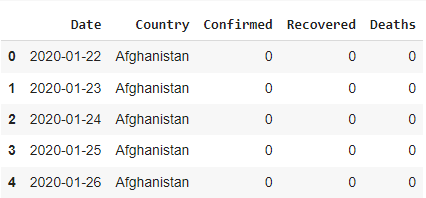
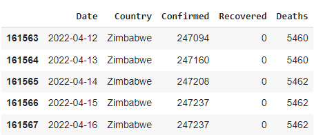
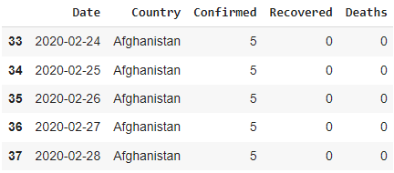
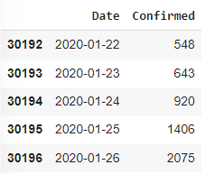
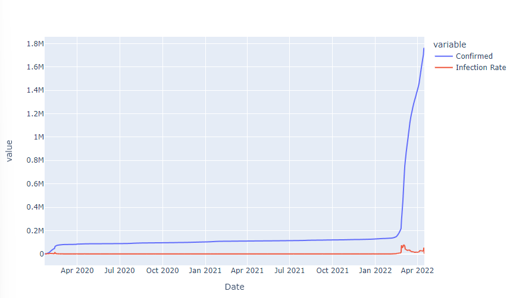
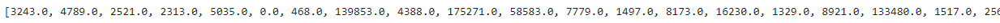
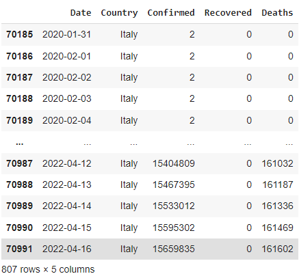

# COVID19-Data-Visualization
Visualize the global spread of COVID-19 using Python
-------------------
This document is written as a log of my working with COVID19 data. This project was done in a spur of a moment purely out of curiosity. You can also find this as an article on my Medium too! 

You can find the link to the Medium article [here](https://medium.com/@raahimkhan_85173/data-cleaning-and-exploratory-data-analysis-with-pandas-on-trending-you-tube-video-statistics-e06d7cd08710).

Now, let's dive in.

First thing first, you can find the dataset I am working with in this project [here]().

Data Cleaning
-------------------
- Importing Libraries 
```Python
import pandas as pd
import numpy as np
import plotly.express as px
import matplotlib.pyplot as plt 
print('modules are imported')
```
- Loading the dataset 
```
dataset_url = 'http://raw.githubusercontent.com/datasets/covid-19/master/data/countries-aggregated.csv'
df = pd.read_csv(dataset_url)
```
- Check the dataframe df
```
df.head()
df.tail()
```


Here we can see the first 5 rows of the dataframe.



Here we can see the last 5 rows of the dataframe.

- Preprocessing
``` 
# We only want values that are greaterf than zero
df = df[df.Confirmed > 0]
df.head()
```



The Global Spread of COVID19
-----------------
```
fig = px.choropleth(df, locations = 'Country', locationmode = 'country names', color = 'Confirmed'
                    , animation_frame = 'Date')
fig.update_layout(title_text = 'Global Spread') # add a title to the map/graph using the title_text argument
fig.show()
```

Here we can see a map of the whole world with countries highlighted in different colors based on their number of confirmed cases. We can use the slide to select a date and the map will change accordingly. 

Similarly, we can also visualize global deaths of COVID19. 
```
fig = px.choropleth(df, locations = 'Country', locationmode = 'country names', color = 'Deaths'
                    , animation_frame = 'Date')
fig.update_layout(title_text = 'Global Death of COVID19')
fig.show()
```


Maximum Infection Rate in Each Country
-------------------------------

An important stats that the CDC keeps track of is the maximum infection rate. I was wondering if I could find a way to visulizate it. Maximum infection rate is the maximum number of newly infected cases over 24 hours. I was particularly interested in finding out more about this stats in China where it stayed the epicenter of the pandemic for an extended period of time. So here I started with extracting data on China from the dataset. 

```
df_china = df[df.Country == 'China'] # I want the rows where Country == China 
df_china.head()
```


then I selected the columns I needed for calculating the Maximum Infection Rates
```
df_china = df_china[['Date', 'Confirmed']]
df_china.head() 
df_china['Infection Rate'] = df_china['Confirmed'].diff()
df_china.head()
px.line(df_china, x = 'Date', y = ['Confirmed','Infection Rate'])
```



The blue line is the number of confirmed cases, and the red line is infection rate

So what was the maximum infection rate in China？
```
df_china['Infection Rate'].max()
```

The maximum number of newly confirmed COVID19 cases in one day in China was **77402**. Wow. 

let's calculate the max infection rates for all of the countries and visualize them
```
df.head()
countries = list(df['[Country'].unique()) # the unique() method will return unique values of the column Country
max_infection_rates = [] # this will add a column to the dataframe
for c in countries :
    MIR = df[df.Country == c].Confirmed.diff().max()
    max_infection_rates.append(MIR)
print(max_infection_rates) # check output, this should give you a huge list of numbers
# lets create a new dataframe
df_MIR = pd.DataFrame()
df_MIR['Country'] = countries
df_MIR['Max Infection Rate'] = max_infection_rates
df_MIR.head()
# plot the barchart: max infection rate of each country
px.bar(df_MIR, x='Country', y='Max Infection Rate', color='Country'
        , title='Global Maximum Infection Rate', log_y = True)
```




Drawing Insights from Italy's COVID19 Data
-----------------------
```
df[df.Country == 'Italy']
```


Now we have a dataframe of 807 rows x 5 columns, showing Italy's COVID19 data. Let's calculate the infection rates in Italy and visualize them. We also want to add a vertical line to observe COVID19 data from before and after the national lockdown in Italy. 
```
# Lets check the dataframe
df_italy.head()
# let's calculate the infection rate in Italy
df_italy['Infection Rate'] = df_italy.Confirmed.diff()
# now let's do the visualization
fig = px.line(df_italy, x='Date', y='Infection Rate', title = 'Before and After Lockdown in Italy')
fig.show()
# now we want to add a vertical line to the line chart to show before and after lockdown
fig.add_shape(
    dict(
    type = 'line', 
    x0 = italy_lockdown_start_date, 
    y0 = 0,
    x1 = italy_lockdown_start_date, 
    y1 = df_italy['Infection Rate'].max(),
    line = dict(color = 'red', width = 2)
    )
)
# add an annotation that describes what this line represent
fig.add_annotation(
    dict(
    x = italy_lockdown_start_date,
    y = df_italy['Infection Rate'].max(),
    text = 'starting date of the lockdown'
    )
)

# now add a line that represents one month after the start of lockdown
fig.add_shape(
    dict(
    type = 'line', 
    x0 = italy_lockdown_start_date, 
    y0 = 0,
    x1 = italy_lockdown_start_date, 
    y1 = df_italy['Infection Rate'].max(),
    line = dict(color = 'red', width = 2)
    )
)
# add an annotation that describes what this line represent
fig.add_annotation(
    dict(
    x = italy_lockdown_start_date,
    y = df_italy['Infection Rate'].max(),
    text = 'starting date of the lockdown'
    )
)
fig.add_shape(
    dict(
    type = 'line', 
    x0 = italy_lockdown_a_month_later, 
    y0 = 0,
    x1 = italy_lockdown_a_month_later, 
    y1 = df_italy['Infection Rate'].max(),
    line = dict(color = 'orange', width = 2)
    )
)
# add an annotation that describes what this line represent
fig.add_annotation(
    dict(
    x = italy_lockdown_a_month_later,
    y = df_italy['Infection Rate'].max(),
    text = 'a month later'
    )
)
```


```
# Part 5: Deaths Rate before and after national lockdown in Italy
# Let's see how national lockdowns impact COVID19 death rate in Italy
df_italy.head()
# let's calculate the deaths rates
df_italy['Deaths Rate'] = df_italy.Deaths.diff() # you will see a warning message but just go on
# let's check the dataframe again
df_italy.head()
# now let's plot a line chart to compare COVID19 national lockdowns on spread of the virus
# and deaths rate
fig = px.line(df_italy, x = 'Date', y = ['Infection Rate', 'Deaths Rate'])
fig.show()

# let's normalize the columns 
# this means that we want every y value to be 0 and 1, 
# so we have to divide every y value by the maximum value of y 
df_italy['Infection Rate'] = df_italy['Infection Rate']/df_italy['Infection Rate'].max()
df_italy['Deaths Rate'] = df_italy['Deaths Rate']/df_italy['Deaths Rate'].max()
# again, you will see a "SettingWithCopyWarning". That is fine just keep going

# let's plot the line chart again
fig = px.line(df_italy, x = 'Date', y = ['Infectio Rate', 'Deaths Rate'])
fig.show()

# add the vertical lines again to show the impact of lockdown
# i wrote the following code for adding 2 vertical lines myself. check later for error
# conclusion: lockdown was effective 
fig.add_shape(
    dict(
    type = 'line', 
    x0 = italy_lockdown_a_month_later, 
    y0 = 0,
    x1 = italy_lockdown_a_month_later, 
    y1 = df_italy['Infection Rate'].max(),
    line = dict(color = 'orange', width = 2)
    )
)
# add an annotation that describes what this line represent
fig.add_annotation(
    dict(
    x = italy_lockdown_a_month_later,
    y = df_italy['Infection Rate'].max(),
    text = 'a month later'
    )
)

fig.add_shape(
    dict(
    type = 'line', 
    x0 = italy_lockdown_start_date, 
    y0 = 0,
    x1 = italy_lockdown_start_date, 
    y1 = df_italy['Infection Rate'].max(),
    line = dict(color = 'black', width = 2)
    )
)
# add an annotation that describes what this line represent
fig.add_annotation(
    dict(
    x = italy_lockdown_start_date,
    y = df_italy['Infection Rate'].max(),
    text = 'starting date of the lockdown'
    )
)


```


COVID19 pandemic lockdown in Germany
---------------------------
```
# Part 6: additional exercise, COVID19 pandemic lockdown in Germany
# lockdown was started in Freiburg, Baden-Wurttemberg and Bavaria on 20 March 2020.
# Three days later, it was expanded to the whole Germany
Germany_lockdown_start_date = '2020-03-23'
Germany_lockdown_a_month_later = '2020-04-23'

# Let's select the data reltaed to Germany and check the dataframe
df_germany = df[df.Country == 'Germany']
df_germany.head()

df_germany['Infection Rate'] = df_germany.Confirmed.diff()
df_germany['Deaths Rate'] = df_germany.Deaths.diff()
df_germany.head()

# Let's do some scalling and plot the line chart (normalization)
df_germany['Infection Rate'] = df_germany['Infection Rate']/df_germany['Infection Rate'].max()
df_germany['Deaths Rate'] = df_germany['Deaths Rate']/df_germany['Deaths Rate'].max()

fig = px.line(df_germany, x = 'Date', y = ['Infection Rate', 'Deaths Rate'])
fig.add_shape(
    dict(
    type = "line",
    x0 = Germany_lockdown_start_date,
    y0 = 0,
    x1 = Germany_lockdown_start_date,
    y1 = df_germany['Infection Rate'].max(),
    line = dict(color = 'black', width = 2)
    )
)

fig.add_annotation(
    dict(
    x = Germany_lockdown_start_date,
    y = df_germany['Infection Rate'].max(),
    text = 'starting date of the lockdown'
    )
)
fig.add_shape(
    dict(
    type = "line",
    x0 = Germany_lockdown_a_month_later,
    y0 = 0,
    x1 = Germany_lockdown_a_month_later,
    y1 = df_germany['Infection Rate'].max(),
    line = dict(color = 'yellow', width = 2)
    )
)
fig.add_annotation(
    dict(
    x = Germany_lockdown_a_month_later,
    y = df_germany['Infection Rate'].max(),
    text = 'a month later'
    )
)
```

