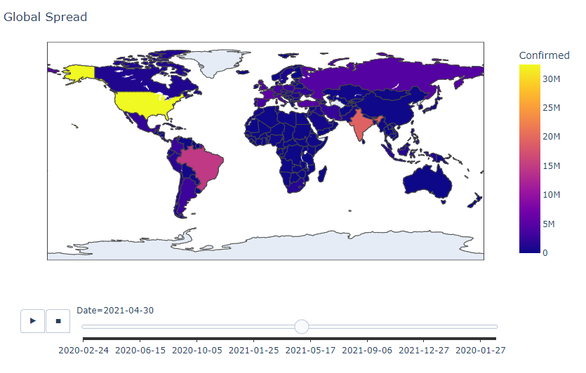
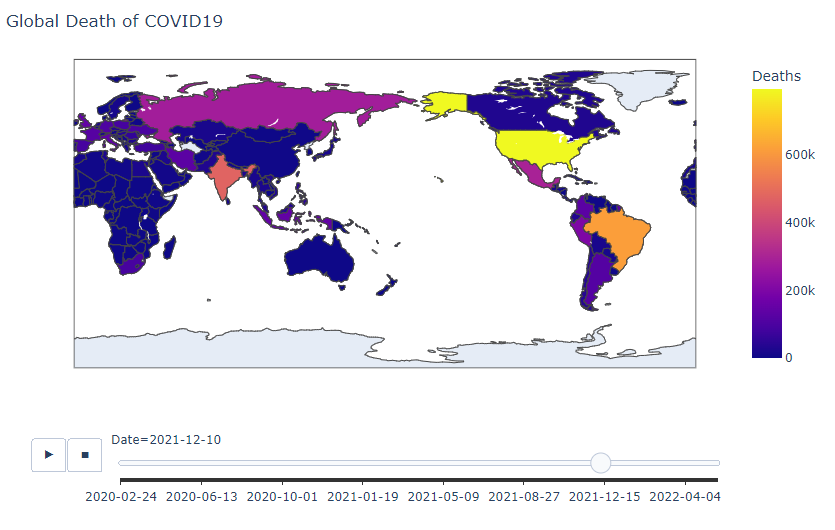

# COVID19-Data-Visualization
Visualize the global spread of COVID-19 using Python
-------------------
This document is written as a log of my working with COVID19 data. This project was done in a spur of a moment purely out of curiosity. You can also find this as an article on my Medium too! 

You can find the link to the Medium article [here](https://medium.com/@raahimkhan_85173/data-cleaning-and-exploratory-data-analysis-with-pandas-on-trending-you-tube-video-statistics-e06d7cd08710).

Now, let's dive in.

First thing first, you can find the dataset I am working with in this project [here]().

Data Cleaning
-------------------
- Importing Libraries 
```Python
import pandas as pd
import numpy as np
import plotly.express as px
import matplotlib.pyplot as plt 
print('modules are imported')
```
- Loading the dataset 
```
dataset_url = 'http://raw.githubusercontent.com/datasets/covid-19/master/data/countries-aggregated.csv'
df = pd.read_csv(dataset_url)
```
- Check the dataframe df
```
df.head()
df.tail()
```


Here we can see the first 5 rows of the dataframe.


Here we can see the last 5 rows of the dataframe.

- Preprocessing
``` 
# We only want values that are greaterf than zero
df = df[df.Confirmed > 0]
df.head()
```


Drawing Insights from Italy's COVID19 Data
-----------------------
```
df[df.Country == 'Italy']
```


Now we have a dataframe of 807 rows x 5 columns, showing Italy's COVID19 data

The Global Spread of COVID19
-----------------
```
fig = px.choropleth(df, locations = 'Country', locationmode = 'country names', color = 'Confirmed'
                    , animation_frame = 'Date')
fig.update_layout(title_text = 'Global Spread') # add a title to the map/graph using the title_text argument
fig.show()
```

Here we can see a map of the whole world with countries highlighted in different colors based on their number of confirmed cases. We can use the slide to select a date and the map will change accordingly. 

Similarly, we can also visualize global deaths of COVID19. 
```
fig = px.choropleth(df, locations = 'Country', locationmode = 'country names', color = 'Deaths'
                    , animation_frame = 'Date')
fig.update_layout(title_text = 'Global Death of COVID19')
fig.show()
```


Maximum Infection Rate in Each Country
-------------------------------

An important stats that the CDC keeps track of is the maximum infection rate. I was wondering if I could find a way to visulizate it. Maximum infection rate is the maximum number of newly infected cases over 24 hours. I was particularly interested in finding out more about this stats in China where it stayed the epicenter of the pandemic for an extended period of time. So here I started with extracting data on China from the dataset. 

```
df_china = df[df.Country == 'China'] # I want the rows where Country == China 
df_china.head()
```


then I selected the columns I needed for calculating the Maximum Infection Rates
```
df_china = df_china[['Date', 'Confirmed']]
df_china.head() 
df_china['Infection Rate'] = df_china['Confirmed'].diff()
df_china.head()
px.line(df_china, x = 'Date', y = ['Confirmed','Infection Rate'])
```


The blue line is the number of confirmed cases, and the red line is infection rate

So what was the maximum infection rate in China？
```
df_china['Infection Rate'].max()
```

The maximum number of newly confirmed COVID19 cases in one day in China was **77402**. Wow. 


maximum number of newly confirmed COIVD19 cases in a day in China? 
